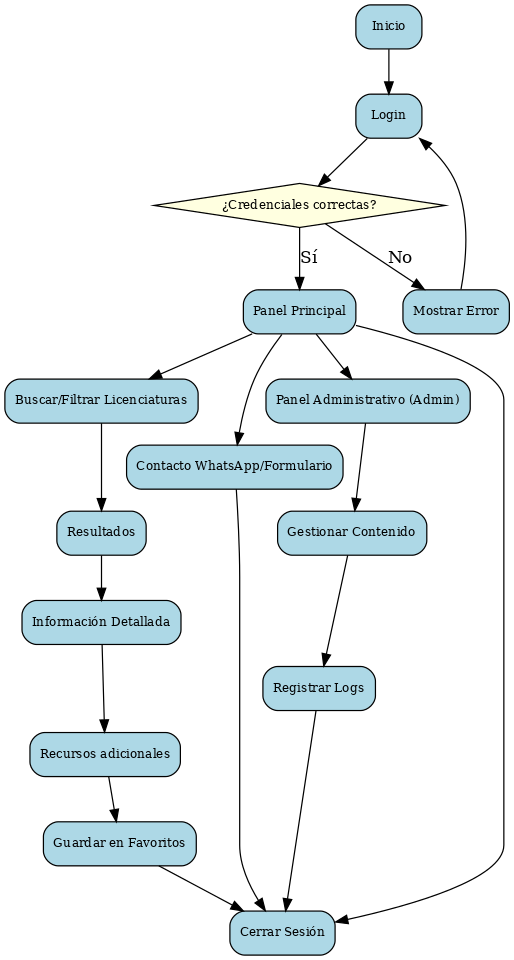

# 🚀 Propuesta Mejorada del Proyecto Semestral

## 📌 Nombre del Proyecto

**Buscador Web UVM - LXO**

---

## 📖 Descripción clara y concisa

**Buscador Web UVM - LXO** es una aplicación web especializada que permite a los asesores comerciales de UVM consultar rápidamente información precisa sobre licenciaturas ejecutivas en línea, facilitando y optimizando el proceso de venta.

---

## 🌟 Beneficios Claros para el Usuario

- ✅ Ahorro de tiempo en la consulta de información  
- ✅ Reducción de errores y omisiones  
- ✅ Incremento en la efectividad del proceso de venta  

---

## ⚙️ Funciones Específicas de la Aplicación

### 🔐 Autenticación Segura
- Acceso mediante correo institucional y contraseña  
- Validación por Firebase Auth o Auth0  

### 🔍 Panel de Búsqueda Avanzada
- Búsqueda predictiva por nombre o palabras clave  
- Filtros avanzados: categoría, modalidad, duración, certificaciones, recursos  

### 📚 Información Detallada por Licenciatura
- Planes de estudio oficiales integrados (PDF)  
- Certificaciones destacadas por cuatrimestre  
- Modalidad, duración, recursos incluidos y ventajas competitivas  
- Tips estratégicos para asesores  
- Respuestas rápidas ante objeciones frecuentes  

### 🎯 Recursos Interactivos Adicionales
- Calculadora dinámica de becas  
- Descarga directa de PDFs informativos  
- Acceso a recursos emergentes (doble titulación, cursos beyond, acreditaciones internacionales)  

### 📲 Funciones Sociales y de Gestión
- Botón para contacto directo vía WhatsApp (mensajes prellenados)  
- Formulario rápido de captación de prospectos (validación automática)  
- Sistema de favoritos para seguimiento de carreras  

---

## 🛠️ Panel Administrativo

- Gestión simplificada de contenidos (añadir, editar, eliminar)  
- Control de accesos por roles (administrador / usuario regular)  
- Registro automático de actividades (logs)  

---

## 🧑‍💻 Estrategia Técnica

### 🎨 Frontend
- `React.js` para interactividad fluida  
- `TailwindCSS` para diseño ágil y adaptable  
- Diseño responsivo garantizado (desktop, tablet, móvil)  

### 🔧 Backend
- `Node.js` con `Express` para gestión de rutas y API REST  
- Autenticación segura mediante `JWT`  

### 📦 Bases de Datos
- Prototipado con `Firebase Firestore`  
- Producción: `MongoDB` (recomendado) o `MySQL`  

### ⚡ Extras Técnicos
- API de WhatsApp o enlaces personalizados  
- Formularios conectados a base de datos + envío por correo  
- Hosting en `Vercel` o `Netlify`  

---

## 🎨 Diseño Visual (Moodboard)

- Interfaz limpia, minimalista y accesible  
- Grid visual efectivo  
- Paleta suave: blanco, azul claro, gris  
- Iconografía intuitiva (estilo LMS o CRMs ligeros)  

---

## 🗃️ Algoritmo Simplificado

1. Inicio de sesión del usuario  
2. Validación de credenciales  
3. Acceso al panel principal con búsqueda y filtros  
4. Visualización completa de información de licenciaturas  
5. Interacción con recursos (PDFs, tips, calculadoras)  
6. Gestión de favoritos  
7. Contacto con prospectos (WhatsApp/Formulario)  
8. Administración de contenido por usuarios autorizados  
9. Registro de actividades y cierre seguro de sesión  

